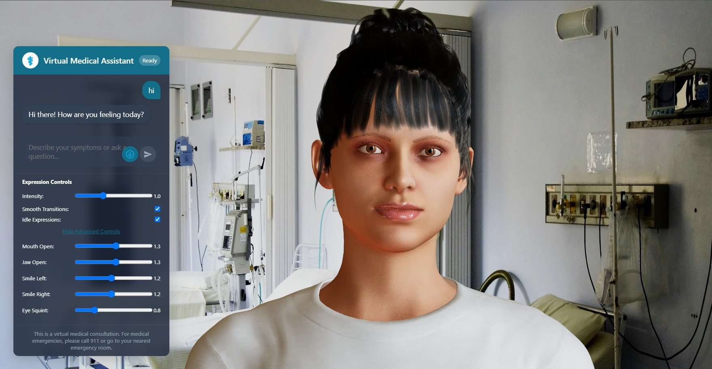

# Talking Avatar Frontend

This is a React-based 3D talking avatar application that uses Three.js and React Three Fiber to render a realistic 3D character that responds to text input with synchronized speech and facial animations.

## Demo Video

[](./public/DEMO/Demo.mp4)
*(Click to view demo video)*
<!-- Alternative format using HTML video tag for better GitHub compatibility -->
<video width="640" height="360" controls>
  <source src="public/DEMO/Demo.mp4" type="video/mp4">
  Your browser does not support the video tag.
</video>

## Features

- 3D avatar with realistic facial animations
- Text-to-speech integration with lip-syncing
- AI-powered conversational abilities through backend integration (OpenAI GPT-3.5, GPT-4, GPT-4o, and more)
- Model selection, temperature, and max tokens controls for GPT
- Per-user memory (username collected in chat)
- Advanced bias mitigation in AI responses
- Speech-to-text functionality for voice input
- Customizable facial expression settings
- Modern, resizable chat interface (drag the bottom-right corner)
- **Doctor's Note PDF Generator:** After a session, generate a downloadable PDF summary (doctor's note) with patient symptoms and advice, using AI-powered summarization.
- **Settings Modal:** All advanced controls (expression controls, voice settings, model selection, temperature, max tokens) are now accessible via a Settings button in the chat header for a cleaner interface.

## Prerequisites

- Node.js (v14 or higher)
- npm or yarn

## Installation

1. Clone the repository:
```bash
git clone <repository-url>
cd talking_avatar
```

2. Install dependencies:
```bash
npm install
```

3. Set up environment variables:
Create a `.env` file in the root directory with the following content:
```
REACT_APP_API_URL=http://localhost:3001
```

## Running the Application

Start the development server:
```bash
npm start
```

The application will be available at `http://localhost:3000`.

**Note:** Make sure the backend server is running at port 3001 for the application to function properly.

## Project Structure

- `/public` - Static assets and index.html
  - `/images` - Textures and image assets for the 3D model
  - `/speech-*.mp3` - Generated speech files (created during runtime)
  - `/DEMO` - Demo videos and other promotional content
- `/src` - Source code
  - `App.js` - Main application component with UI and 3D scene setup
  - `converter.js` - Utility for converting blend shape data to animations
  - `blendDataBlink.json` - Default blinking animation data

## Avatar Customization

The avatar can be customized through several parameters in the `App.js` file:

- Facial expression intensity
- Transition smoothing between expressions
- Micro-expressions during pauses
- Specific facial feature emphasis (mouth, eyes, etc.)

## AI Chat Features

- **Per-User Memory:** The assistant remembers your conversation context by username (entered in chat).
- **Bias Mitigation:** Dr. Ava is tuned to avoid bias and stereotypes, and backend post-processing filters problematic phrases.
- **Resizable Chat Box:** Drag the bottom-right corner of the chat interface to resize the whole chat window.
- **Advanced Controls:** Access model selection, temperature, max tokens, voice, and expression controls via the Settings modal (⚙️ button in chat header).

## Settings Modal

The chat interface now features a **Settings** (⚙️) button in the top right of the chat header. Clicking this button opens a modal popup containing all advanced controls:

- **Expression Controls:** Fine-tune facial animation intensity, smoothing, idle expressions, and advanced viseme settings.
- **Voice Settings:** Select the avatar's voice and speaking style.
- **AI Model Selection:** Choose between Llama3, GPT-3.5 Turbo, GPT-4, GPT-4o, and more.
- **Temperature & Max Tokens:** Adjust GPT creativity and response length.

These controls are no longer shown directly in the chat area, keeping the main interface clean and focused on conversation. Close the modal to return to chatting.

## Built With

- [React](https://reactjs.org/) - Frontend framework
- [Three.js](https://threejs.org/) - 3D rendering library
- [React Three Fiber](https://github.com/pmndrs/react-three-fiber) - React renderer for Three.js
- [React Three Drei](https://github.com/pmndrs/drei) - Useful helpers for React Three Fiber
- [Axios](https://axios-http.com/) - HTTP client for API requests

## Communication with Backend

The frontend communicates with the backend server to:

1. Send text to be converted to speech
2. Get audio files and blendshape data for facial animations
3. Generate AI-powered responses with model/temperature/max tokens controls

API endpoints used:
- `/talk` - Main endpoint for text-to-speech with facial animation data
- `/talk-stream` - Streaming version of the text-to-speech endpoint
- `/ask_gpt` - OpenAI GPT chat endpoint (model selection, temp, max tokens, bias mitigation)

## Troubleshooting

- If the avatar is not visible, check browser console for Three.js errors
- If speech is not playing, verify that audio is enabled in your browser
- For network issues, check that the backend server is running and accessible

## Doctor's Note PDF Generator

After your conversation with Dr. Ava, you can generate a professional "Doctor's Note" PDF summarizing your session:

- Click the **Download Doctor's Note** button below the chat area.
- The assistant will automatically summarize the session using AI, filtering out greetings and focusing on your symptoms and the advice given.
- The PDF includes:
  - **Patient Name**
  - **Date**
  - **Patient Symptoms:** A concise summary of your symptoms and relevant context
  - **Doctor's Advice:** Actionable, friendly advice from Dr. Ava
- The summary is formatted for clarity, with no markdown or extra symbols.

**How it works:**
- All assistant messages (except greetings) are sent to the backend for summarization using GPT.
- The prompt enforces a clear, bullet-point format for both symptoms and advice.
- The PDF is generated instantly in your browser and can be saved or shared.
